# ARGoinde 2, Electric Boogaloo - A Walkthrough

At last. The long-awaited, second ARG.

The following walkthrough gives our journey through solving this set of puzzles, as well
as hopefully explaining how some things lead to other clues, the required thought process, and
perhaps some of the other things that were attempted before we hit the solutions.

## Table of Contents

- [Introduction](#introduction)
- [Clue Sheet](#clue-sheet)
- [First Clue](#first-clue)
- [Whatnow](#whatnow)
  - [Bing](#bing)
- [Episode 5](#episode-5)
- [Episode 4](#episode-4)
- [a00000000](#a00000000)
- [The Wait](#the-wait)
- [The Return](#the-return)
- [To Infinity and Beyond](#to-infinity-and-beyond)
  - [Unsolved Clue](#unsolved-clue)
- [Minecraft](#minecraft)
  - [The End](#the-end)
  - [Nether](#nether)
- [Finale... For Now](#finale-for-now)

## Introduction

For some background, [an ARG is short for "alternate reality game"](https://en.wikipedia.org/wiki/Alternate_reality_game). Basically, it's a giant
puzzle. Think those mystery shows where you have pins and rope connecting a bunch of clues.


This was not the first one created by Alg (or even the second one on the server, appu did one as well). There was one hosted way back in 2019 when `#tech-science` was still but a fledgling channel, not yet overrun by Linux shills and Guya. One can read about this one [here](https://docs.google.com/document/d/1kpnfIyhpEnKLNH9DcDtIhPSthILxaVB0IFeWRotNpbs/edit?usp=sharing).

## Clue Sheet

The clue sheet/table compiled can be found [here](https://docs.google.com/spreadsheets/d/1mVBWFEy8_TZRpFm83GHDENKbpFNzj0i2yTvQetj1uME/edit#gid=0). It may be helpful to use to follow along.

## First Clue

On 2020-06-16, Alg posted [this following message](https://discordapp.com/channels/329966811057618944/644228686442135563/722505134285783190) to the `#public-changelogs` channel:


Seemingly innocent, yet upon investigating, one could notice a hidden, blank emote stuck to the end of the message. Coupled with a cryptic message, and some people realized that a new puzzle had come.

Hovering over the emote revealed that it had the name `18347689111674`. After getting stuck on this and not knowing where to look for a few hours, it was found that Alg had changed the emote in his status to now use the emote name `5F_34_m15_m15_5d_59_03`.

After Alg revealed that `m15` meant `-15`, some big brains added the two together as a hex:

```
  0x  18  34  76  89  11  16  74
+ 0x  5F  34 -15 -15  5d  59  03
--------------------------------
  0x  77  68  61  74  6E  6F  77
```

Converting this to ASCII revealed the word "whatnow".

## Whatnow

Searching for this in the Kaguya server would lead to an edited message:


This was supposed to be a prompt for people to visit a BGS server. Unfortunately, we didn't realize which one (it was some smaller third one apparently). We then got stuck on this (see [Bing](#bing) for what happened during this). Alg eventually bailed us out of this clue by getting someone who was in [that third BGS server](https://discord.gg/GvwE3n9) to check and revealed:


Using the `44796` as a MangaDex chapter entry, one goes to [this MangaDex page](https://www.mangadex.org/title/44796/the-kids-have-changed), which leads to the [following comment](https://www.mangadex.org/thread/204497/3/):


Note that this message was different initially; it was changed during the ARG to better fit our progress in [Episode 5](#episode-5).

### Bing

So, what _actually_ happened was that after seeing the "whatnow" clue, a _certain_ member just **Binged** "Algoinde" and searched through his information on Mangadex... leading to the comment. This lead to actually skipping a step (namely going to the BGS server) and starting [Episode 5](#episode-5) earlier than expected without having actually solved the `Whatnow` clue. However, during the solving of that, that's when Alg bailed us out in showing the BGS server, leaving us to be back to not having skipped anything.

## Episode 5

Using the results of the MangaDex comment, it was concluded that the message contained 3 parts:

- `28C4A85D` corresponded to the hash of the MKV file.
- `#0:2(eng)` corresponded to the subtitle track. One could get this by searching online or using a tool like `mkvextract` as follows:

  ```bash
  mkvextract tracks \[GJM\]\ Kaguya-sama\ \~Love\ is\ War\~\ S2\ -\ 05\ \[28C4A85D\].mkv\ 2:05.ass
  ```

- `#166:13-22` likely corresponded to some kind of string indexing or subtraction.

This is where we got stuck for a while. Did it mean line 166? Dialog 166? Was the `13 - 22` a subtraction? A range? 0-indexing? Eventually, people deduced (with some help from a likely disappointed Alg) that we were looking for line 166 of the file, _where any Comment lines were removed_ (for example, using mkvextract necessitates this). The line was as follows:

```
Dialogue: 50,0:06:02.06,0:06:06.64,GJM_Main_1080p,Ka,0,0,0,,{\q2}Recently, the appearance of the man she's \Nsomewhat interested in has changed drastically...
```

From there, taking the correct string range gives `0:06:02.06` --- googling this leads to [a link on MusicSwap](https://musicswap.livejournal.com/1119784.html), where another comment from Algoinde was awaiting us:

```
[1:s]

(A38B175B #0:2 #3187:60-68) + (-600,-900)
```

## Episode 4

This clue looked identical to the last one, so immediately we found that the hash, `A38B175B`, corresponded to episode 4 of the GJM release of Kaguya, season 2. `#0:2` again represented the subtitle track. This time, we wanted line 3187, range 60 to 68.

After extracting the subtitles , we got the following line:

```
Dialogue: 1,0:04:04.76,0:04:04.89,iFanzSigns,,0,0,0,,{\an7\pos(641,986)\org(856,912)\fscx102\frz-40.42\fry-10.42\frx-9.91\fax1.21\fnKozuka Gothic Pro H\fs13.68\blur1}This book will help you change \N{\1a&HFF&}.....{\fs12.83\1a&H00&}your life using computers
```

The important part of the extracted string was `(641,986)`. adding the `+ (-600,-900)`, this gave a coordinate of `(41,86)`. Tying this back to the original emote in the very first clue, it was found that the pixel at that spot was of the RGB value `(16, 6, 16)`. While this wasn't a 6 digit number, this is a valid nhentai.net number... leading us to (NSFW)[this nHentai link](https://nhentai.net/g/16616/). While the contents themselves _were_ tasteful yuri, that wasn't important - the comment Alg had left on it was:


## a00000000

Googling `a00000000` lead to a [Twitter account](https://twitter.com/a00000000), named "Iroha". After getting stuck for a while, this was discovered to actually be a reference to [the Iroha from Oregairu](https://oregairu.fandom.com/wiki/Iroha_Isshiki) and prompt to go to the [Oregairu server](https://discord.gg/PQ2kJCv) and look for a comment from Alg:


## The Wait

After finishing the Oregairu clue, we got stuck for a _long_ time. We were not sure how to use the Oregairu clue - what could we do with this ⧜ thing?

Eventually, Algoinde came back to prompt us to re-use one of existing numbers - and this lead to re-using `16616` as "chapter 166, page 16" of Kaguya. Looking at the chapter on [guya.moe](https://guya.moe/166/16) revealed a modified chapter page and some hidden dots representing Morse code, spelling out:

```
-..-. .-- .- .. - .-.-.- .... - -- .-.
```

or, in plaintext, `wait.htmr`. Assuming this meant `wait.html`, we went to [Alg's site with that path](https://algoinde.ru/wait.html) and were greeted with:


We had known well in advance that there was a time gate at some point, so now it was time to, well, wait.

## The Return

A few weeks later, Alg gave a heads up - the ARG was back.

Checking [wait.html](https://algoinde.ru/wait.html) no longer worked. However, [https://algoinde.ru/wait.html](https://algoinde.ru/wait.html), which was the original morse code deciphering, _did_ work, leading to a file with the contents:

```
4172838-5
```

Checking [https://algoinde.ru/4172838-5](https://algoinde.ru/4172838-5) would in turn give a file with the contents:

```
wait.htmr
```

which didn't really help.

Googling "4172838-5" lead to results for the constellation Orion. If one checks the server message history, one is lead to [this message](https://discordapp.com/channels/329966811057618944/643650478067941385/6683411505197875):


This was a reference to [Alg's submission](https://www.youtube.com/watch?v=glJfKeBzjLg&feature=youtu.be) to the 2019 art contest. Inspecting the video, there was an annotation at the end that lead to [another](https://www.youtube.com/watch?v=b3CHFS1xMLU) video, where the description wrote:


Furthermore, checking the Russian transcript of the submission video revealed the following text:

```
Орион не при чем - здесь есть другая звезда, сравнимая по яркости.
```

or translated (courtesy of Witch):

```
Orion has nothing to do with this, another star with comparable brightness exists here.
```

The [right acension](https://en.wikipedia.org/wiki/Right_ascension) of a star is measured in hours, minutes, and seconds. Using the given clue, we obtained a timestamp to Kaguya, episode 3, which mentions Kimi no Shiranai Monogatari. This lead to a comment on the [Kimi no Shiranai Monogatari](https://bakemonogatari.fandom.com/wiki/Kimino_Shiranai_Monogatari) wiki page:

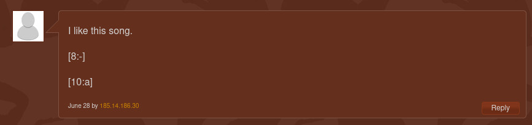

The clue of importance here was the username - this was an IP address, [185.14.186.30](http://185.14.186.30/), which had the following contents:

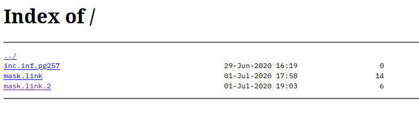

## To Infinity and Beyond

"inc_inf", in combination with the "⧜" clue from before, was a clue to the document ["U+29DC aka Documento Continuo"](http://www.linkartcenter.eu/public/editions/Enrico_Boccioletti_U%2B29DC_aka_Documento_Continuo_2014.pdf).

On page 257, the following text was there:

```
#Stacktivism
A term coined by Jay Springett
Which posits that “we cannot have a conversation about something whilst it remains unseen” derived from Benjamin Bratton’s work on ‘The Stack’
#stacktivism is a term that attempts to give form to a critical conversation & line of enquiry around infrastructure & the relationship we have to it, whilst asking the question “who controls the means of  not dying?”

http://pastebin.com/bm1EKB9H

BY: BEN_VICKERS ON OCT 21ST, 2013
SYNTAX: NONE
SIZE: 6.61 KB
HITS: 545
EXPIRES: NEVER
```

The file, `mask.link`, contained the following text:

```bash
cut -d"/" -f4
```

Running `cut` on the link in page text gave:

```
bm1EKB9H
```

`mask.link.2`, a hint that was actually later provided by Alg, contained:

```
0 = _
```

Now, using the previous clue of `a0x8`, we got the string "abm1EKB9H", which upon searching for in the server:

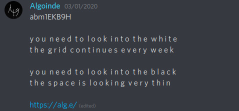

The link actually contains hidden zero-width spaces, which you can see if you copy and check it:

```
y o u  n e e d  t o  l o o k  i n t o  t h e  w h i t e
t h e  g r i d  c o n t i n u e s  e v e r y  w e e k

y o u  n e e d  t o  l o o k  i n t o  t h e  b l a c k
t h e  s p a c e  i s  l o o k i n g  v e r y  t h i n
https://alg.e/‍‍‌‍‍‌‌‍‍‌‍‌‍‍‍‍
```

```python
>>> s = 'https://alg.e/‍‍'
>>> s.encode("unicode_escape")
b'https://alg.e/\\u200d\\u200d\\u200c\\u200d\\u200d\\u200c\\u200c\\u200d\\u200d\\u200c\\u200d\\u200c\\u200d\\u200d\\u200d\\u200d'
```

Replacing `https://alg.e/` with `zws.im/` links to [https://algoinde.ru/25566](https://algoinde.ru/25566).

### Unsolved clue

Alg later revealed that the rest of the string itself contains a clue, which we were supposed to use later. However, we skipped it and actually never used it, so... this clue isn't totally solved, for anyone interested.

## Minecraft

25566 was a port. So, we tried to visit [http://shuchiin.algoinde.ru:25566/](http://shuchiin.algoinde.ru:25566/) and [
185.14.186.30:25566](185.14.186.30:25566) (both links are the same), which gave an error like:

```java
«Ё{"translate":"disconnect.genericReason","with":["Internal Exception: io.netty.handler.codec.DecoderException: java.lang.IndexOutOfBoundsException: Index: 69, Size: 1"]}
```

Googling this error turned out to be a common Minecraft error. And lo and behold, checking for a server on [mcsrvstat](https://mcsrvstat.us/server/shuchiin.algoinde.ru:25566/) revealed:

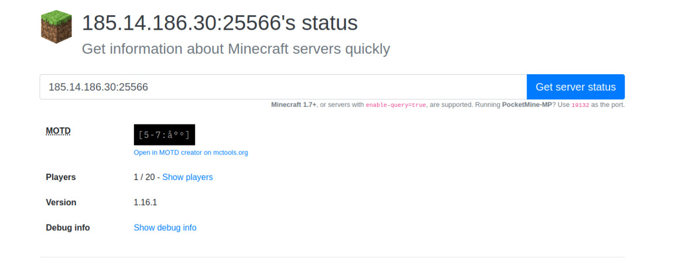

...it was fscking Minecraft.

### The End

Entering the server, there was a tower containing a chest with compasses named "Τέλος" and pointing to different directions. This indicated the compasses were pointing to lodestones.

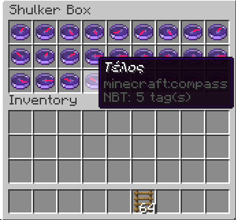

"Τέλος" means "end goal" in Greek. So, this indicated that we had to enter the End, kill the Ender Dragon to use the compasses to reach some destination.

So for the next few hours, a few players spent time playing Minecraft to reach the End and completing the game. Upon doing so, the players followed the compasses and explored the end.

The first clue found was both:

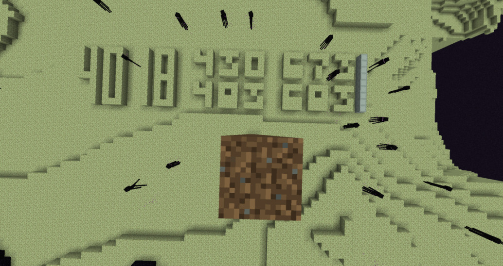

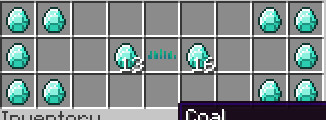

where both were in the same location. This was to represent chapter 40, page 18, with a square bounding box from (430, 673) to (483, 683):

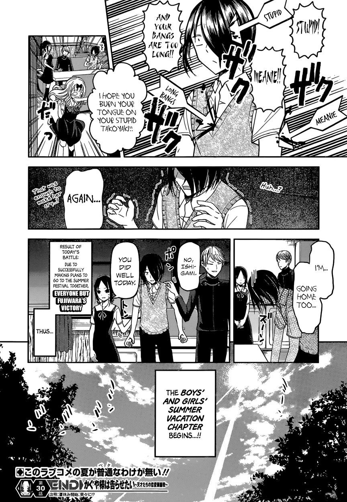

giving:

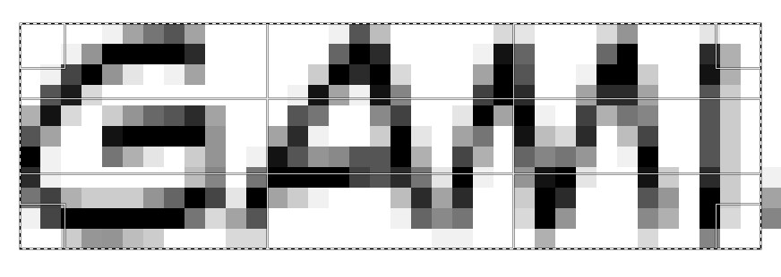

So, we got "gami" as [13:16].

We also found an end city containing 3 pillars. One contained a sign with the text "大洲 鮎 キャンプ":

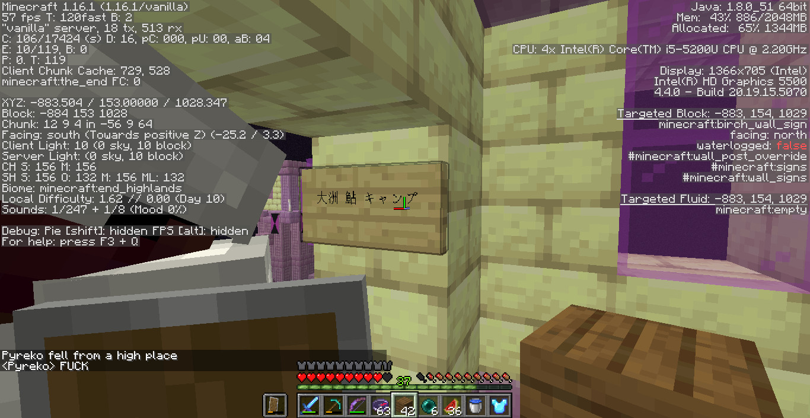

The third had:

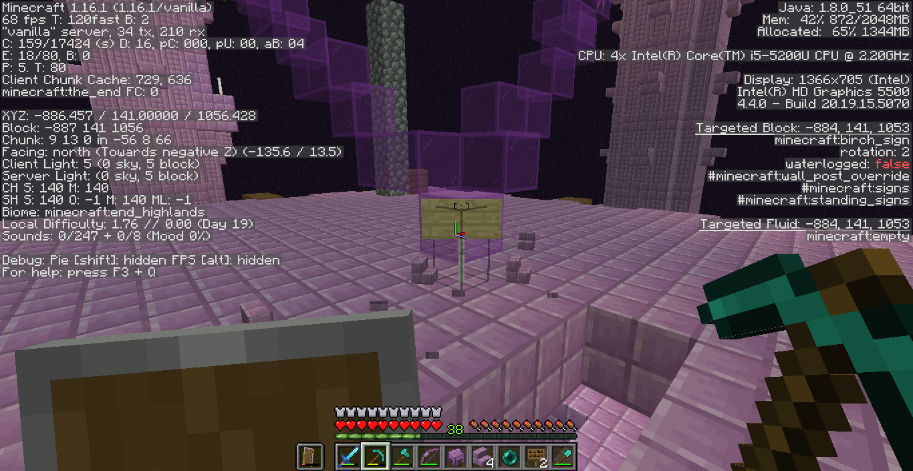

In the middle of an end city, we found a Shulker with a swastika name, and signs underneath it forming a "+":

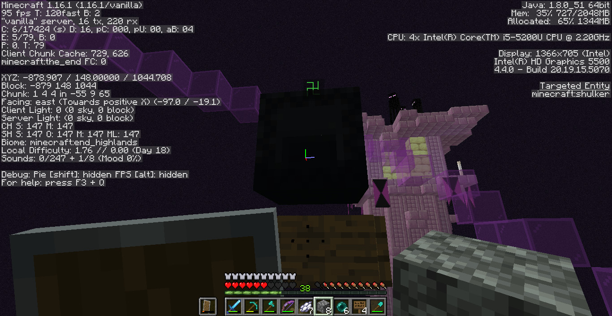

Lastly, in one tower, we found a new set of compasses pointing in different directions, named "gqELqRCnW6g" - this is a valid YouTube video link, to the Minecraft Yogscast parody ["Screw the Nether"](https://www.youtube.com/watch?v=gqELqRCnW6g), indicating these compasses were tied to a lodestone in the Nether.

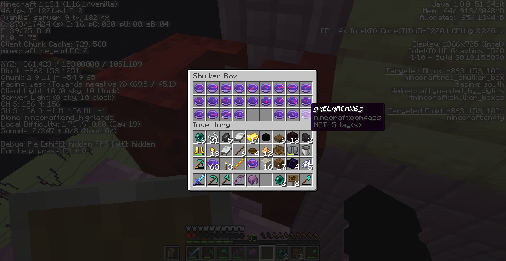

#### Nether

Traversing to the Nether using these coordinates revealed a location with buttons, redstone torches, and soul torches:

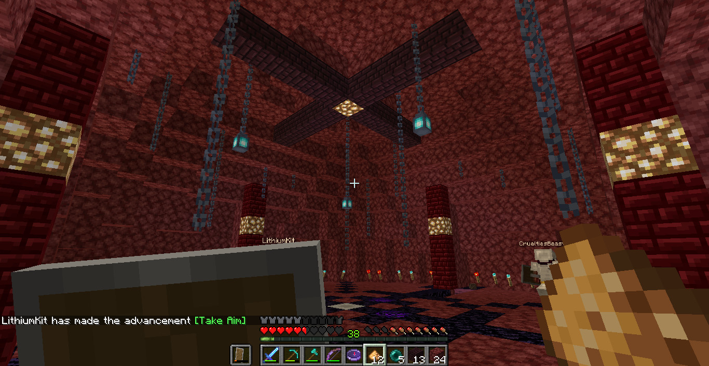

The order was as follows:

```
1R
3B
1R
BUTTON
1R
5B
1R
3B
1R
4B
5R
END
SECOND:
1R
5B
3R
BUTTON
1R
1B
1R
1B
1R
3B
1R
1B
1R
2B
2R
2B
3R
END
```

## Finale... For Now

So by the time we hit this point, we had a plethora of clues to work with.

Putting together all the string clues we had gotten, we had:

```
[1:s]
[2:h]
[3:u]
[4:u]
[5-7:å°º]
[8:-]
[10:a]
[13-16:GAMI]
```

One of the clues that didn't make sense was the 5-7 clue. We found that putting `å°º` into a Unicode decoder gave the Chinese character for ruler, "尺", which translates to "chi". This therefore left us with:

```
[1:s]
[2:h]
[3:u]
[4:u]
[5-7:chi]
[8:-]
[10:a]
[13-16:GAMI]
```

Putting this in order, we had `shuuchi-_a__gami`. The missing letters were actually supposed to be obtained from solving the [Unsolved Clue](#unsolved-clue), but with what we had, we guessed this string was supposed to represent "Shuuchi-kasagami", which is a train station.

So, at this point, we had these following clues:

- "Shuuchi-kasagami"
- Blank sign with "[ ]"
- Shulker with the swastika and "+" sign
- "大洲 鮎 キャンプ"
- Torch code

Solving the torch code, we concluded that it was representing decimal values in binary. Using either the red or blue torches as 1 were valid, so we tried both:

```
100001.10000010001000011111 -> 33.50833034515380859375
10000011.10101000101001100111 -> 131.65878963470458984375

or

011110.01111101110111100000 -> 30.491668701171875
01111100.01010111010110011000 -> 124.34120941162109375
```

"大洲 鮎 キャンプ" was also a real location that could be found on Google Maps.

The "[ ]" also seemed to be referencing the "Shuuchi-kasagami" result.

Then, the "+" sign under the Shulker reminded some users of a [Plus code](https://plus.codes/). And the swastika Shulker was in the middle of a triangle. The "卍" symbol also refers to Buddhist temples on maps.

So someone decided to plot the following points on a map:

- Shuuchi-kasagami station
- 大洲 鮎 キャンプ
- Torch values as coordinates

and lo and behold, in the middle, was an island that contained two Buddhist temples, Jofukiji and Jokeiji.

We weren't sure which one to pick, but after some triangle magic (and praying), we concluded on picking Jokeiji:

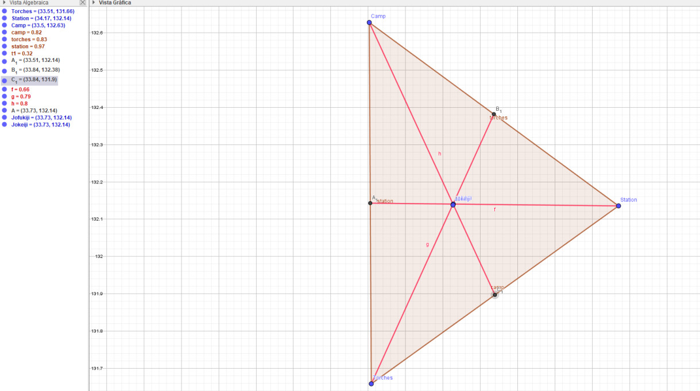

From here, we submitted the Plus code of this temple, `8Q5JP4HR+36`.

And after a long silence, we were greeted with:

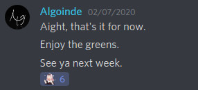

And as such, this is where the ARG stands as of writing.
