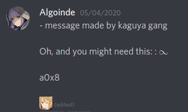
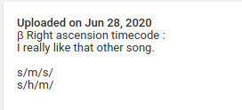

# ARGoinde 2, Electric Boogaloo - A Walkthrough

At last. The long-awaited, second ARG.

The following walkthrough gives our journey through solving this set of puzzles, as well
as hopefully explaining how some things lead to other clues, the required thought process, and
perhaps some of the other things that were attempted before we hit the solutions.

## Table of Contents

- [Introduction](#introduction)
- [Clue Sheet](#clue-sheet)
- [First Clue](#first-clue)
- [Whatnow](#whatnow)
  - [Bing](#bing)
- [Episode 5](#episode-5)
- [Episode 4](#episode-4)
- [a00000000](#a00000000)
- [The Wait](#the-wait)
- [The Return](#the-return)

## Introduction

For some background, [an ARG is short for "alternate reality game"](https://en.wikipedia.org/wiki/Alternate_reality_game). Basically, it's a giant
puzzle. Think those mystery shows where you have pins and rope connecting a bunch of clues.


This was not the first one created by Alg (or even the second one on the server, appu did one as well). There was one hosted way back in 2019 when `#tech-science` was still but a fledgling channel, not yet overrun by Linux shills and Guya. One can read about this one [here](https://docs.google.com/document/d/1kpnfIyhpEnKLNH9DcDtIhPSthILxaVB0IFeWRotNpbs/edit?usp=sharing).

## Clue Sheet

The clue sheet/table compiled can be found [here](https://docs.google.com/spreadsheets/d/1mVBWFEy8_TZRpFm83GHDENKbpFNzj0i2yTvQetj1uME/edit#gid=0). It may be helpful to use to follow along.

## First Clue

On 2020-06-16, Alg posted [this following message](https://discordapp.com/channels/329966811057618944/644228686442135563/722505134285783190) to the `#public-changelogs` channel:


Seemingly innocent, yet upon investigating, one could notice a hidden, blank emote stuck to the end of the message. Coupled with a cryptic message, and some people realized that a new puzzle had come.

Hovering over the emote revealed that it had the name `18347689111674`. After getting stuck on this and not knowing where to look for a few hours, it was found that Alg had changed the emote in his status to now use the emote name `5F_34_m15_m15_5d_59_03`.

After Alg revealed that `m15` meant `-15`, some big brains added the two together as a hex:

```
  0x  18  34  76  89  11  16  74
+ 0x  5F  34 -15 -15  5d  59  03
--------------------------------
  0x  77  68  61  74  6E  6F  77
```

Converting this to ASCII revealed the word "whatnow".

## Whatnow

Searching for this in the Kaguya server would lead to an edited message:


This was supposed to be a prompt for people to visit a BGS server. Unfortunately, we didn't realize which one (it was some smaller third one apparently). We then got stuck on this (see [Bing](#bing) for what happened during this). Alg eventually bailed us out of this clue by getting someone who was in [that third BGS server](https://discord.gg/GvwE3n9) to check and revealed:


Using the `44796` as a MangaDex chapter entry, one goes to [this MangaDex page](https://www.mangadex.org/title/44796/the-kids-have-changed), which leads to the [following comment](https://www.mangadex.org/thread/204497/3/):


Note that this message was different initially; it was changed during the ARG to better fit our progress in [Episode 5](#episode-5).

### Bing

So, what _actually_ happened was that after seeing the "whatnow" clue, a _certain_ member just **Binged** "Algoinde" and searched through his information on Mangadex... leading to the comment. This lead to actually skipping a step (namely going to the BGS server) and starting [Episode 5](#episode-5) earlier than expected without having actually solved the `Whatnow` clue. However, during the solving of that, that's when Alg bailed us out in showing the BGS server, leaving us to be back to not having skipped anything.

## Episode 5

Using the results of the MangaDex comment, it was concluded that the message contained 3 parts:

- `28C4A85D` corresponded to the hash of the MKV file.
- `#0:2(eng)` corresponded to the subtitle track. One could get this by searching online or using a tool like `mkvextract` as follows:

  ```bash
  mkvextract tracks \[GJM\]\ Kaguya-sama\ \~Love\ is\ War\~\ S2\ -\ 05\ \[28C4A85D\].mkv\ 2:05.ass
  ```

- `#166:13-22` likely corresponded to some kind of string indexing or subtraction.

This is where we got stuck for a while. Did it mean line 166? Dialog 166? Was the `13 - 22` a subtraction? A range? 0-indexing? Eventually, people deduced (with some help from a likely disappointed Alg) that we were looking for line 166 of the file, _where any Comment lines were removed_ (for example, using mkvextract necessitates this). The line was as follows:

```
Dialogue: 50,0:06:02.06,0:06:06.64,GJM_Main_1080p,Ka,0,0,0,,{\q2}Recently, the appearance of the man she's \Nsomewhat interested in has changed drastically...
```

From there, taking the correct string range gives `0:06:02.06` --- googling this leads to [a link on MusicSwap](https://musicswap.livejournal.com/1119784.html), where another comment from Algoinde was awaiting us:

```
[1:s]

(A38B175B #0:2 #3187:60-68) + (-600,-900)
```

## Episode 4

This clue looked identical to the last one, so immediately we found that the hash, `A38B175B`, corresponded to episode 4 of the GJM release of Kaguya, season 2. `#0:2` again represented the subtitle track. This time, we wanted line 3187, range 60 to 68.

After extracting the subtitles , we got the following line:

```
Dialogue: 1,0:04:04.76,0:04:04.89,iFanzSigns,,0,0,0,,{\an7\pos(641,986)\org(856,912)\fscx102\frz-40.42\fry-10.42\frx-9.91\fax1.21\fnKozuka Gothic Pro H\fs13.68\blur1}This book will help you change \N{\1a&HFF&}.....{\fs12.83\1a&H00&}your life using computers
```

The important part of the extracted string was `(641,986)`. adding the `+ (-600,-900)`, this gave a coordinate of `(41,86)`. Tying this back to the original emote in the very first clue, it was found that the pixel at that spot was of the RGB value `(16, 6, 16)`. While this wasn't a 6 digit number, this is a valid nhentai.net number... leading us to (NSFW)[this nHentai link](https://nhentai.net/g/16616/). While the contents themselves _were_ tasteful yuri, that wasn't important - the comment Alg had left on it was:


## a00000000

Googling `a00000000` lead to a [Twitter account](https://twitter.com/a00000000), named "Iroha". After getting stuck for a while, this was discovered to actually be a reference to [the Iroha from Oregairu](https://oregairu.fandom.com/wiki/Iroha_Isshiki) and prompt to go to the [Oregairu server](https://discord.gg/PQ2kJCv) and look for a comment from Alg:



## The Wait

After finishing the Oregairu clue, we got stuck for a _long_ time. We were not sure how to use the Oregairu clue - what could we do with this ⧜ thing?

Eventually, Algoinde came back to prompt us to re-use one of existing numbers - and this lead to re-using `16616` as "chapter 166, page 16" of Kaguya. Looking at the chapter on [guya.moe](https://guya.moe/166/16) revealed a modified chapter page and some hidden dots representing Morse code, spelling out:

```
-..-. .-- .- .. - .-.-.- .... - -- .-.
```

or, in plaintext, `wait.htmr`. Assuming this meant `wait.html`, we went to [Alg's site with that path](https://algoinde.ru/wait.html) and were greeted with:


We had known well in advance that there was a time gate at some point - and that we had hit it.

## The Return

A few weeks later, Alg gave a heads up - the ARG was back.

Checking [wait.html](https://algoinde.ru/wait.html) no longer worked. However, [https://algoinde.ru/wait.html](https://algoinde.ru/wait.html), which was the original morse code deciphering, _did_ work, leading to a file with the contents:

```
4172838-5
```

Checking [https://algoinde.ru/4172838-5](https://algoinde.ru/4172838-5) would in turn give a file with the contents:

```
wait.htmr
```

which didn't really help.

Googling "4172838-5" lead to results for the constellation Orion. If one checks the server message history, one is lead to [this message](https://discordapp.com/channels/329966811057618944/643650478067941385/6683411505197875):


This was a reference to [Alg's submission](https://www.youtube.com/watch?v=glJfKeBzjLg&feature=youtu.be) to the 2019 art contest. Inspecting the video, there was an annotation at the end that lead to [another](https://www.youtube.com/watch?v=b3CHFS1xMLU) video, where the description wrote:



Furthermore, checking the Russian transcript of the submission video revealed the following text:

```
Орион не при чем - здесь есть другая звезда, сравнимая по яркости.
```

or translated (courtesy of Witch):

```
Orion has nothing to do with this, another star with comparable brightness exists here.
```
